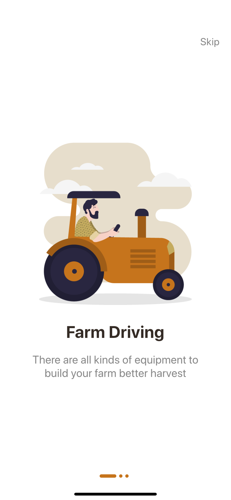
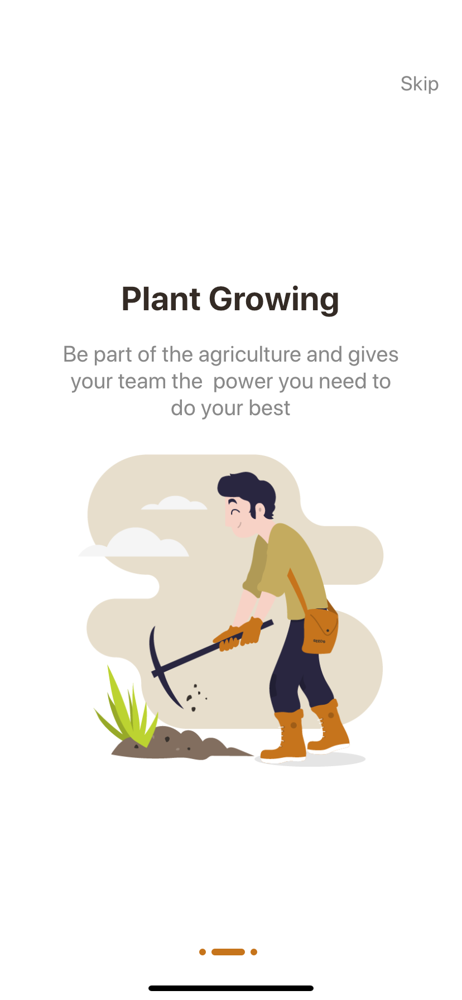
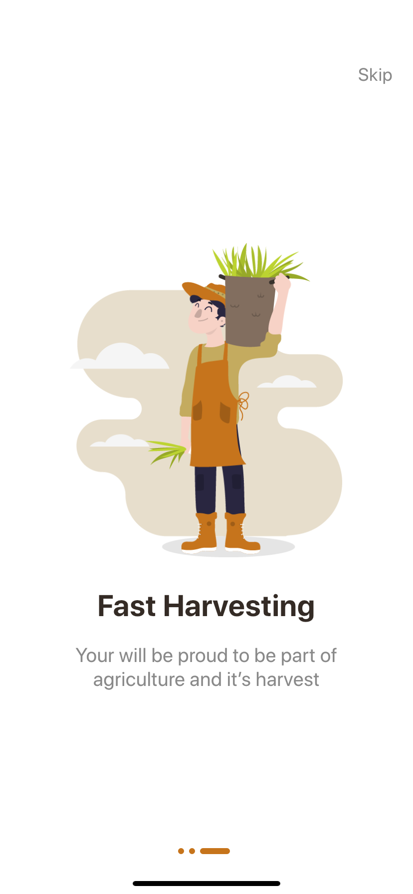

## Flutter App Intro With Indicators Application UI Design and Animation

A part of #flutter100daysofcode. Let's create a beautiful and animated App Intro Application UI with Flutter.

Designed by [Yasir Ahmad Noori (@yasirnoori)](https://bit.ly/2Lswf9j) on Instagram

### [Watch it on Youtube](https://youtu.be/d_hQoKomfdE)


## Previous Designs
[Checkout my Youtube channel](https://youtube.com/afgprogrammer)


## Development Setup
Clone the repository and run the following commands:
```
flutter pub get
flutter run
```

## ScreenShot

&nbsp;
&nbsp;

## Links

* [Website](https://afgprogrammer.com)
* [Youtube channel](https://youtube.com/afgprogrammer)
* [Twitter](https://twitter.com/afgprogrammer)
* [Instagram](https://instagram.com/afgprogrammer)
